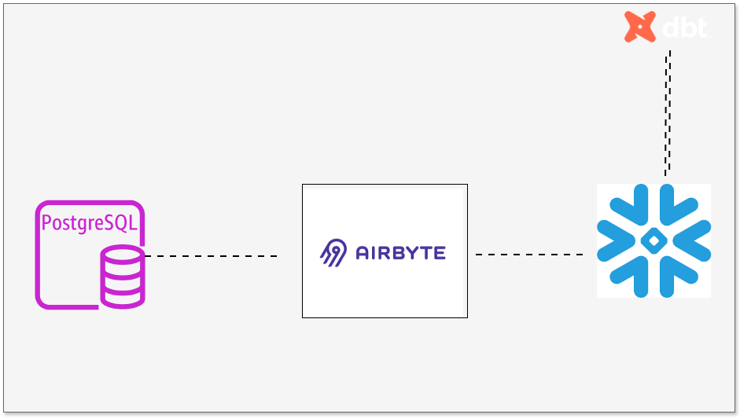
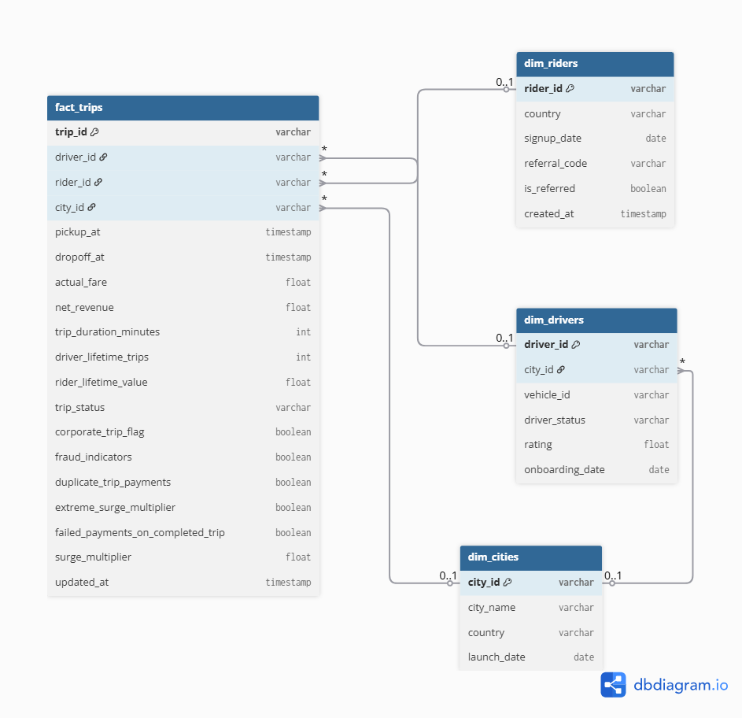
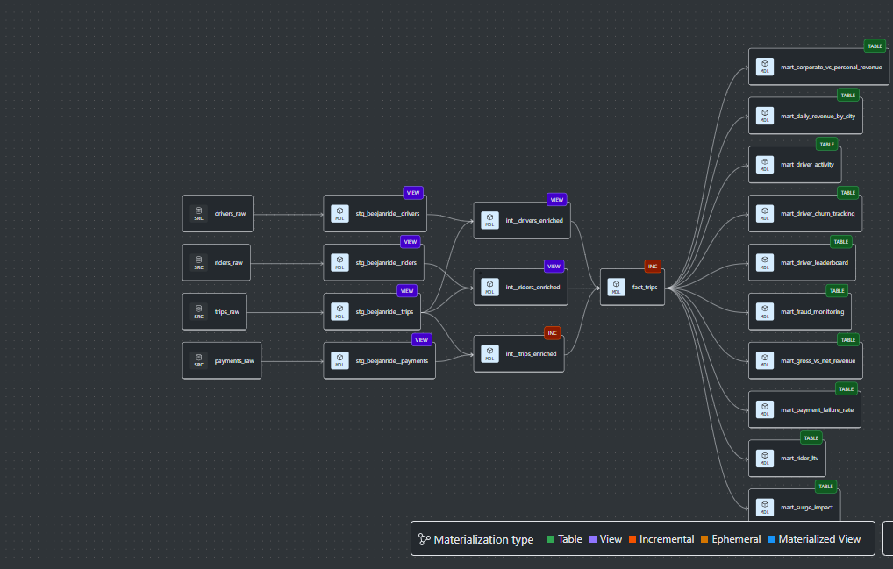

## BeejanRide dbt Analytics Platform
End-to-end analytics pipeline for BeejanRide, a UK ride-hailing startup operating across 5 cities. Built with Airbyte + dbt Core + Snowflake, implementing a layered Star Schema architecture with fraud detection, finance reporting, operations analytics, and SCD Type 2 snapshots.

## Project Overview
- Raw transactional data is ingested from a Postgres database into Snowflake's raw schema using Airbyte. 
- dbt then transforms this data through three layers. 
- Domain-specific aggregate marts are then built and organised into three schemas — finance, operations, and fraud.

The goal wasn't just to move data. It was to build something reliable, scalable, and trustworthy — the kind of platform where an analyst can open a dashboard and not have to wonder whether the numbers are right.

## Business Objectives
The platform was built to answer these core business questions:
| # | Question | Mart |
|---|---|---|
| 1 | How much revenue are we making per city, per day? | `daily_revenue_by_city` |
| 2 | What's the gap between gross and net revenue? | `gross_vs_net_revenue` |
| 3 | How much of our revenue is corporate vs personal? | `corporate_vs_personal` |
| 4 | Who are our top-performing drivers? | `driver_leaderboard` |
| 5 | How active are drivers day-to-day? | `driver_activity` |
| 6 | What is the lifetime value of each rider? | `rider_ltv` |
| 7 | How often are payments failing, and where? | `payment_failure_rate` |
| 8 | How is surge pricing affecting trip volume and revenue? | `surge_impact` |
| 9 | Which drivers are going quiet — are they churning? | `driver_churn_tracking` |
| 10 | Where is fraud happening in our trip data? | `fraud_monitoring` |

## Architecture


- The Pipeline is split into these layers

| Layer | Materialisation | Models | Job |
|---|---|---|---|
| 1. Source | Raw Tables | 6 | Ingested from Postgres via Airbyte — untouched |
| 2. Staging | Views | 6 | Clean, rename, cast, deduplicate |
| 3. Intermediate | Views + Incremental | 3 | Business logic, enrichment, window functions |
| 4. Core | Tables | 4 | Star schema — the single source of truth |
| 5. Marts | Tables | 10 | Domain-specific aggregations for the business |

## Project Structure
```
dbt-beejanride/
├── models/
│   ├── staging/
│   │   ├── _stg_beejanride.yml          
│   │   ├── stg_beejanride__trips.sql
│   │   ├── stg_beejanride__payments.sql
│   │   ├── stg_beejanride__drivers.sql
│   │   ├── stg_beejanride__riders.sql
│   │   ├── stg_beejanride__cities.sql
│   │   └── stg_beejanride__driver_status_events.sql
│   ├── intermediate/
│   │   ├── _int_beejanride.yml
│   │   ├── int__trips_enriched.sql
│   │   ├── int__drivers_enriched.sql
│   │   └── int__riders_enriched.sql
│   └── marts/
│       ├── _mart_beejanride.yml
│       ├── fact_trips.sql
│       ├── dim_drivers.sql
│       ├── dim_riders.sql
│       ├── dim_cities.sql
│       ├── finance/
│       │   ├── mart_daily_revenue_by_city.sql
│       │   ├── mart_gross_vs_net_revenue.sql
│       │   ├── mart_corporate_vs_personal_revenue.sql
│       │   └── mart_payment_failure_rate.sql
│       ├── operations/
│       │   ├── mart_driver_activity.sql
│       │   ├── mart_driver_leaderboard.sql
│       │   ├── mart_driver_churn_tracking.sql
│       │   ├── mart_surge_impact.sql
│       │   └── mart_rider_ltv.sql
│       └── fraud/
│           └── mart_fraud_monitoring.sql
├── tests/
│   └── completed_payments.sql          
├── macros/
│   └── calculate_net_revenue.sql
|   └── generate_schema_name.sql
├── dbt_project.yml
```
## Technology Stack

| Tool | Purpose |
|---|---|
| **PostgreSQL** | Source transactional database |
| **Airbyte** | Data ingestion |
| **Snowflake** | Cloud data warehouse |
| **dbt Core** | Transformation, testing, documentation |
| **Git + GitHub** | Version control |

## Data Model — ERD
BeejanRide's warehouse is built around a single central fact — a trip. Every business question traces back to fact_trips. After transformation, the data is reshaped into a clean star schema. fact_trips sits at the centre, with three dimension tables hanging off it.



## Data Lineage
From those 6 raw tables, dbt builds 23 models across 5 layers. Each mart is built for a specific business domain — no model does two jobs. The lineage flows top-down: raw → staging → intermediate → core → marts.



## Pipeline Layers

Now that you've seen the full picture, here's what each layer actually does under the hood.

### Staging:  Clean the raw data

The staging layer -  Its only job is to make the data safe to use downstream — no business logic lives here.

Every staging model:
- Renames columns to snake_case
- Casts to the correct data types
- Filters out records with a null primary key

| Model | Source | 
|---|---|
| `stg__trips` | trips_raw | 
| `stg__payments` | payments_raw | 
| `stg__drivers` | drivers_raw | 
| `stg__riders` | riders_raw |
| `stg__cities` | cities_raw | 
| `stg__driver_status_events` | 

---

### Intermediate — Add business logic

The intermediate layer- This is where raw cleaned data becomes business-meaningful data. Models here are reusable — fact_trips and every mart pulls from them.

| Model | Type | What it adds |
|---|---|---|
| `int__trips_enriched` | Incremental | `net_revenue`, `trip_duration_minutes`, `corporate_trip_flag`, `fraud_indicators`, `duplicate_trip_payments`, `failed_payments_on_completed_trip`, `extreme_surge_multiplier` (>10) |
| `int__drivers_enriched` | View | `driver_lifetime_trips` — total trips a driver has ever done |
| `int__riders_enriched` | View | `rider_lifetime_value` — total fare spend across all trips |

## The `calculate_net_revenue` macro: 
 
 — Net revenue logic is used in 5+ models. Rather than copy-pasting the formula, it lives in one macro.

### Star schema

The core layer assembles everything into the star schema. `fact_trips` is incremental and joins the three enriched intermediate models. The dimension tables are small and change infrequently.

**fact_trips key columns:**

| Column | Type |
|---|---|
| `trip_id` | varchar | 
| `driver_id` | varchar |
| `rider_id` | varchar | 
| `city_id` | varchar |
| `actual_fare` | float | 
| `net_revenue` | float |
| `trip_duration_minutes` | int | 
| `driver_lifetime_trips` | int | 
| `rider_lifetime_value` | float | 
| `fraud_indicators` | boolean |
| `extreme_surge_multiplier` | boolean |
| `corporate_trip_flag` | boolean |

---

## Mart Models

Each one has a single grain, a clear domain, and answers a specific business question. 

### Finance *(tag: finance)*

| Mart | Grain | Key Metrics |
|---|---|---|
| `daily_revenue_by_city` | day × city | `gross_revenue`, `net_revenue`, `total_trips` |
| `gross_vs_net_revenue` | month | `total_deductions = SUM(actual_fare - net_revenue)` |
| `corporate_vs_personal` | month × trip_type | Revenue split by trip type |
| `payment_failure_rate` | day × city | `failure_rate_pct = failed / total * 100` |

### Operations *(tag: operations)*

| Mart | Grain | Key Metrics |
|---|---|---|
| `driver_activity` | driver × day | `trips_on_day`, `total_drive_time_minutes`, `daily_earnings` |
| `driver_leaderboard` | driver | `total_trips`, `total_net_revenue`, `avg_fare_per_trip` |
| `driver_churn_tracking` | driver | `days_since_last_trip`, `churn_status` (active / at_risk / churned) |
| `surge_impact` | day × city | `extreme_surge_trips`, `avg_fare`, `total_net_revenue` |
| `rider_ltv` | rider | `gross_spend`, `ltv`, `first_trip_at`, `last_trip_at` |

### Fraud *(tag: fraud)*

| Mart | Grain | Flags |
|---|---|---|
| `fraud_monitoring` | flagged trip_id | `duplicate_trip_payments`, `extreme_surge_multiplier`, `failed_payments_on_completed_trip` |

---

## Snapshots — SCD Type 2

Drivers change over time — their status flips, they switch vehicles, their rating moves. Hence the need for snapshot to to track history.

## Design Decisions
### 1. Incremental materialisation
fct__trips is materialised as an incremental model using pickup_at as the watermark. Snowflake charges by compute, so running a full refresh of a growing trips table on every dbt run would be costly and slow. Incremental ensures only new trips are processed each run, keeping costs predictable as the platform scales.

### 2. Views for staging and intermediate layers
Staging and intermediate models are materialised as views rather than tables. These layers contain no aggregation and are not queried directly by dashboards, so there is no performance benefit to storing them as tables. Views keep storage costs low and ensure the logic is always evaluated against the latest raw data.

### 3. Tables for mart aggregates
Mart models are materialised as tables because they are queried directly by dashboards. It saves time and it is compute optimized. Pre-computing and storing the aggregations means dashboard queries execute in milliseconds rather than scanning the full fact table on every load.

### 4. Separate schemas per business domain
Mart models are separated into finance, operations, and fraud schemas in Snowflake. This gives each team access only to their domain, makes permission management straightforward, and keeps the warehouse organised as the number of models grows.

## Tradeoffs
### Incremental Loading vs. Simplicity
Making fact_trips and int__trips_enriched incremental reduces Snowflake compute costs significantly at scale. But incremental models are require a reliable 'updated_at' column, and can silently miss late-arriving records,  which is a real risk in a payments and fraud context.

### Keeping detail vs. accidentally duplicating rows
Instead of collapsing rows when calculating driver trip counts and rider spend, I kept every single trip row intact but it caused 8 duplicate rows to sneak in when joining tables together. Because the intermediate models were trip-grained (one row per trip per driver), when you I joined on driver_id — which appeared multiple times, so it matched every trip row to every driver row and multiplied them. That's where the 8 duplicates came from.

## Documentation & Governance
Every model in this project is documented in its _schema.yml:

- Model description — what it is, what grain it's at, who uses it
- Column descriptions — plain English, not just the column name restated
- Business metric definitions — e.g. net_revenue means fare collected minus platform fee, not gross fare
- Owner metadata — meta: {owner: data-engineering@beejanride.com}
- Tags — finance, operations, fraud for filtering in the docs site

## Sample Analytical Queries

### 1. Daily Revenue per City
```sql
select
    -- Truncate the timestamp to adjust the date so we can group by day
    date_trunc('day', pickup_at) as trip_date,
    city_id, 
    -- This counts the total number of completed trips on this day in this city
    count(trip_id) as total_trips,
    -- This measures the full fare(Gross) the rider paid before any deductions
    sum(actual_fare) as gross_revenue,
    -- This measures the what the company retains after driver payout and fees
    sum(net_revenue) as net_revenue
from {{ ref('fact_trips') }}
    -- This accounts for only completed trips
where trip_status = 'completed'
group by 1, 2
```

### 2. Gross vs Net Revenue by Month
```sql
select
    date_trunc('month', pickup_at) as trip_month,
    sum(actual_fare) as gross_revenue,
    -- Revenue after driver payouts and processing fees
    sum(net_revenue) as net_revenue,
    -- This calculates the driver's fee plus processing fee
    sum(actual_fare - net_revenue) as total_deductions
from {{ ref('fact_trips') }}
where trip_status = 'completed'
group by 1
```

### 3. Corporate vs Personal Revenue Split
```sql
select
    date_trunc('month', pickup_at) as trip_month,
    -- This flag indicates which one is corporate and personal
    case
        when corporate_trip_flag then 'corporate'
        else 'personal'
    end as trip_type,
    count(trip_id) as total_trips,
    -- Gross revenue before deductions, for personal and corporate
    sum(actual_fare) as gross_revenue,
    -- Net revenue retained, for personal and corporate
        sum(net_revenue) as net_revenue
from {{ ref('fact_trips') }}
where trip_status = 'completed'
group by 1, 2
```

### 4. Top Drivers by Revenue
```sql
select
    driver_id,
    -- How many completed trips this driver has done
    count(trip_id) as total_trips,
    -- Total net revenue this driver has generated for BeejanRide
    sum(net_revenue) as total_net_revenue,
    -- Average fare per trip, to map productivity
    avg(actual_fare) as avg_fare_per_trip,
    -- Most recent trip timestamp — useful to confirm driver is still active
    max(pickup_at) as last_trip_at,
    -- Lifetime trips 
    driver_lifetime_trips
from {{ ref('fact_trips') }}
where trip_status = 'completed'
-- Group by driver and lifetime trips (lifetime trips is driver level--one row per driver))
group by 1, 6
-- Best performing drivers appear at the top
order by total_net_revenue desc
```

### 5. Driver Activity — Daily Breakdown
```sql
select
    driver_id,
    -- One row per driver per day
    date_trunc('day', pickup_at) as activity_date,
    -- How many trips they completed on this day
    count(trip_id) as trips_on_day,
    -- Total minutes they spent actively driving (pickup to dropoff)
    sum(trip_duration_minutes) as total_drive_time_minutes,
    -- How much they earned on this the day for BeejanRide
    sum(net_revenue) as daily_earnings
from {{ ref('fact_trips') }}
where trip_status = 'completed'
group by 1, 2
```

### 6. Rider Lifetime Value
```sql
select
    rider_id,
    -- Total number of completed trips this rider has taken
    count(trip_id) as total_trips,
    -- When they first used BeejanRide
    min(pickup_at) as first_trip_at,
    -- When they last used BeejanRide — helps identify dormant riders
    max(pickup_at) as last_trip_at,
    -- Total amount the rider has been charged across all trips
    sum(actual_fare) as gross_spend,
    -- This is the net revenue BeejanRide has earned from this rider lifetime
    rider_lifetime_value as ltv
from {{ ref('fact_trips') }}
where trip_status = 'completed'
-- Group by rider and ltv (ltv is rider-level, already aggregated in int__riders_enriched)
group by 1, 6
```

### 7. Payment Failure Rate — Last 30 Days
```sql
select
    date_trunc('day', pickup_at) as trip_date,
    city_id,

    -- Denominator: all completed trips on this day in this city
    count(trip_id) as completed_trips,

    -- Numerator: trips where the payment failed despite the ride completing
    sum(failed_payments_on_completed_trip::int) as failed_payments,

    -- Failure rate as a percentage, rounded to 2 decimal places 
    round(
        sum(failed_payments_on_completed_trip::int) / nullif(count(trip_id), 0) * 100, 2) as failure_rate_pct

from {{ ref('fact_trips') }}
where trip_status = 'completed'
group by 1, 2

```

### 8. Surge Impact by City
```sql
select
    date_trunc('day', pickup_at) as trip_date,
    city_id,

    -- All trips on this day in this city (completed only)
    count(trip_id) as total_trips,

    -- Count of trips flagged as extreme surge (multiplier > 10)
   count_if(extreme_surge_multiplier) as extreme_surge_trips,
    -- Average fare across all trips — compare with extreme_surge_trips
    -- to see how much surge is inflating the average
    avg(actual_fare) as avg_fare,

    -- Net revenue on this day, revenue should increase a bit here
    sum(net_revenue) as total_net_revenue

from {{ ref('fact_trips') }}
where trip_status = 'completed'
group by 1, 2
```

### 9. Driver Churn Breakdown
```sql
select
        -- find each driver's most recent trip
    driver_id,
    last_trip_at,
    driver_lifetime_trips,
        -- How many days have passed since their last trip
    datediff('day', last_trip_at, current_timestamp) as days_since_last_trip,
    case
        -- If it is more than 30 days then churned
        when datediff('day', last_trip_at, current_timestamp) > 30
        then 'churned'
        -- If it 14-30 days, then the driver is at risk of getting churned
        when datediff('day', last_trip_at, current_timestamp) > 14
        then 'at_risk'
        -- if it is within 14 days since their last trip, then active
        else 'active'
    end as churn_status
from last_trips
```

### 10. Fraud Monitoring
```sql
select
    driver_id,
    rider_id,
    trip_id,
    pickup_at,
    city_id,
    actual_fare,
    duplicate_trip_payments,
    fraud_indicators,
    extreme_surge_multiplier,
    failed_payments_on_completed_trip
from {{ ref('fact_trips') }}
where
    fraud_indicators = true
    or duplicate_trip_payments = true
    or extreme_surge_multiplier = true
```


